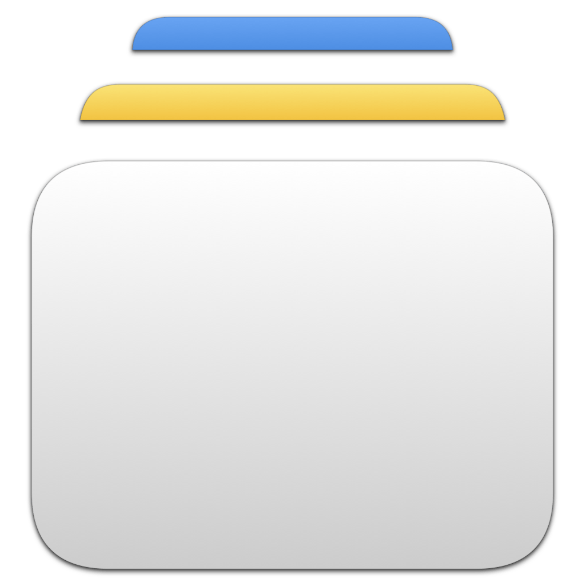

<p align="center">
    
</p>

<p align="center">
    
    
    <a href="https://danielsaidi.github.io/PresentationKit"></a>
    <a href="https://github.com/danielsaidi/PresentationKit/blob/master/LICENSE"></a>
    <a href="https://github.com/sponsors/danielsaidi"></a>
</p>


# PresentationKit

PresentationKit is a SwiftUI library that makes it easy to present alerts, sheets, and full screen covers for any type, using observable ``AlertContext``, ``FullScreenCoverContext``, and ``SheetContext`` classes.

<p align="center">
    
</p>

PresentationKit lets you register a presentation for any identifiable model, and will create and inject unique context values for each modal layer. This lets you use the current contexts to present new content from any view.


## Installation

PresentationKit can be installed with the Swift Package Manager:

```
https://github.com/danielsaidi/PresentationKit.git
```


## Supported Platforms

PresentationKit supports iOS 17, tvOS 17, macOS 14, watchOS 10, and visionOS 1.


## Support My Work

You can [become a sponsor][Sponsors] to help me dedicate more time on my various [open-source tools][OpenSource]. Every contribution, no matter the size, makes a real difference in keeping these tools free and actively developed.


## Getting Started

With PresentationKit, just add a `.presentation(for: ...)` modifier to your application root, then use any of the environment injected ``AlertContext``, ``FullScreenCoverContext``, and ``SheetContext`` to present alerts & modals.

For instance, consider that we have the following, super-simple type, which in a real world app could be a complex model, an error type, a screen-defining enum, or any type that you want to present:

```swift
struct Model: Identifiable {

    let id: Int
}
```

All we have to do to be able to present this type in an alert or a modal is to define a presentation strategy like this:

```swift
@main
struct MyApp: App {

    var body: some Scene {
        WindowGroup {
            ContentView()
                .presentation(
                    for: Model.self,
                    alertContent: { value in
                        AlertContent(
                            title: "Alert",
                            actions: {
                                Button("OK", action: { print("OK for item #\(value.id)") })
                                Button("Cancel", role: .cancel, action: {})
                            },
                            message: { Text("Alert for item #\(value.id)") }
                        )
                    },
                    coverContent: { 
                        ModalView(value: $0, title: "Cover") 
                    },
                    sheetContent: { 
                        ModalView(value: $0, title: "Sheet")
                    }
                )
        }
    }
}
```

You can omit any builder that you're not going to use. To only alert errors, you only have to provide an alert content builder. To only present modals, you only have to provide a modal content builder.

The ContentView, and all views in its modal hierarchy, can now present model values using the various contexts:

```swift
struct ContentView: View {

    @Environment(AlertContext<Model>.self) private var alert
    @Environment(FullScreenCoverContext<Model>.self) private var cover
    @Environment(SheetContext<Model>.self) private var sheet

    private let value = Model(id: 1)

    var body: some View {
        NavigationStack {
            List {
                Button("Present an alert") {
                    alert.present(value)
                }
                Button("Present a full screen cover") {
                    cover.present(value)
                }
                Button("Present a sheet") {
                    sheet.present(value)
                }
            }
            .navigationTitle("Demo")
        }
    }
}
```

PresentationKit will automatically apply the same presentation strategy to all its modals, using new context values. This means that this will automatically work:

```swift
struct ModalView: View {

    let value: Model
    let title: String

    @Environment(\.dismiss) private var dismiss

    @Environment(AlertContext<Model>.self) private var alert
    @Environment(FullScreenCoverContext<Model>.self) private var cover
    @Environment(SheetContext<Model>.self) private var sheet

    private let value = Model(id: 2)

    var body: some View {
        NavigationStack {
            List {
                Button("Present another alert") {
                    alert.present(value)
                }
                Button("Present another full screen cover") {
                    cover.present(value)
                }
                Button("Present another sheet") {
                    sheet.present(value)
                }
            }
            .navigationTitle(title)
            .toolbar {
                ToolbarItem(placement: .primaryAction) {
                    Button("Dismiss", role: .cancel) {
                        dismiss()
                    }
                }
            }
        }
    }
}
```

In other words, you only have to specify your presentation strategy *once*, after which the same presentation logic will work in the entire app.


## Documentation

The online [documentation][Documentation] has more information, articles, code examples, etc.


## Demo Application

The `Demo` folder has a demo app that lets you explore the library.


## Contact

Feel free to reach out if you have questions, or want to contribute in any way:

* Website: [danielsaidi.com][Website]
* E-mail: [daniel.saidi@gmail.com][Email]
* Bluesky: [@danielsaidi@bsky.social][Bluesky]
* Mastodon: [@danielsaidi@mastodon.social][Mastodon]


## License

PresentationKit is available under the MIT license. See the [LICENSE][License] file for more info.


[Email]: mailto:daniel.saidi@gmail.com
[Website]: https://danielsaidi.com
[GitHub]: https://github.com/danielsaidi
[OpenSource]: https://danielsaidi.com/opensource
[Sponsors]: https://github.com/sponsors/danielsaidi

[Bluesky]: https://bsky.app/profile/danielsaidi.bsky.social
[Mastodon]: https://mastodon.social/@danielsaidi
[Twitter]: https://twitter.com/danielsaidi

[Documentation]: https://danielsaidi.github.io/PresentationKit
[Getting-Started]: https://danielsaidi.github.io/PresentationKit/documentation/PresentationKit/getting-started
[License]: https://github.com/danielsaidi/presentationkit/blob/master/LICENSE
